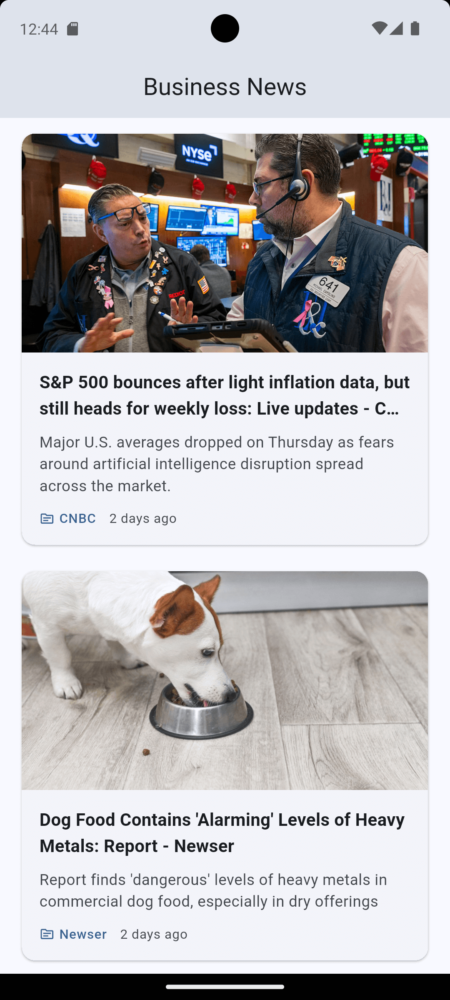

# Flutter News App - Clean Architecture with BLoC

A Flutter news app demonstrating **Clean Architecture** with **BLoC pattern** for state management. Features List-Detail navigation, Pull-to-Refresh, offline caching, and comprehensive unit tests covering Presentation, Domain, and Data layers.

## Features

- **Clean Architecture**: Domain, Data, and Presentation layers with clear separation of concerns
- **BLoC State Management**: Predictable state management using flutter_bloc
- **Offline Support**: Caches last fetched articles for offline viewing
- **Pull-to-Refresh**: Swipe down to refresh articles
- **Article Detail View**: WebView integration for reading full articles
- **Material 3 Design**: Modern UI with dynamic color support
- **Comprehensive Unit Tests**: Tests for all layers (Presentation, Domain, Data)

## Screenshots

<p align="center">
  
  &nbsp;&nbsp;&nbsp;&nbsp;
  
</p>

<p align="center">
  <em>Article List (Pull-to-Refresh)</em>
  &nbsp;&nbsp;&nbsp;&nbsp;&nbsp;&nbsp;&nbsp;&nbsp;&nbsp;&nbsp;&nbsp;&nbsp;&nbsp;&nbsp;&nbsp;&nbsp;&nbsp;&nbsp;&nbsp;&nbsp;&nbsp;&nbsp;&nbsp;&nbsp;&nbsp;&nbsp;
  <em>Article Detail (WebView)</em>
</p>

## Architecture

```
lib/
├── core/                          # Core utilities and shared code
│   ├── config/                    # Environment configuration
│   ├── constants/                 # API constants
│   ├── error/                     # Exceptions and failures
│   ├── network/                   # Network connectivity
│   └── util/                      # Utilities (date formatting)
│
├── features/
│   └── articles/
│       ├── data/                  # Data layer
│       │   ├── datasources/       # Remote and local data sources
│       │   ├── models/            # Data models with JSON serialization
│       │   └── repositories/      # Repository implementations
│       │
│       ├── domain/                # Domain layer (business logic)
│       │   ├── entities/          # Business entities
│       │   ├── repositories/      # Repository interfaces
│       │   └── usecases/          # Use cases
│       │
│       └── presentation/          # Presentation layer
│           ├── bloc/              # BLoC (events, states, bloc)
│           ├── pages/             # Pages/Screens
│           └── widgets/           # Reusable widgets
│
├── router/                        # Navigation with go_router
├── app.dart                       # App widget with theme
├── injection_container.dart       # Dependency injection
└── main.dart                      # Entry point
```

## Getting Started

### Prerequisites

- Flutter SDK 3.38.9 or higher
- Dart SDK 3.10.0 or higher
- Android emulator/device or iOS simulator/device
- Register for a free NewsAPI Key at [newsapi.org](https://newsapi.org/register)

### Installation

1. Clone the repository:
```bash
git clone https://github.com/paulo-pimentel/flutter-clean-architecture-bloc-news-app.git
cd flutter_clean_architecture_bloc_news_app
```

2. Install dependencies:
```bash
flutter pub get
```

3. Create a `.env` file from the example:
```bash
cp .env.example .env
```

4. Edit `.env` and add your NewsAPI key:
```env
NEWS_API_KEY=your_actual_api_key_here
```

5. Run the app:
```bash
flutter run
```

### Running Tests

```bash
flutter test
```

### Run the App

Connect an Android emulator/device or iOS simulator/device, then:
```bash
flutter run
```

## Key Technologies

| Technology | Purpose |
|------------|---------|
| [flutter_bloc](https://pub.dev/packages/flutter_bloc) | State management |
| [get_it](https://pub.dev/packages/get_it) | Dependency injection |
| [dartz](https://pub.dev/packages/dartz) | Functional programming (Either type) |
| [go_router](https://pub.dev/packages/go_router) | Declarative navigation |
| [equatable](https://pub.dev/packages/equatable) | Value equality |
| [cached_network_image](https://pub.dev/packages/cached_network_image) | Image caching |
| [webview_flutter](https://pub.dev/packages/webview_flutter) | WebView for article detail |
| [flutter_dotenv](https://pub.dev/packages/flutter_dotenv) | Environment variables from .env file |
| [mocktail](https://pub.dev/packages/mocktail) | Mocking for tests |
| [bloc_test](https://pub.dev/packages/bloc_test) | BLoC testing utilities |

## Modern Dart 3.x Features

This project leverages modern Dart 3.x features:

- **Sealed Classes**: For exhaustive pattern matching in states, events, and failures
- **Pattern Matching**: Switch expressions for cleaner state handling
- **Final Classes**: For implementation classes that shouldn't be extended
- **Abstract Interface Classes**: For contract definitions
- **Records**: Where appropriate for simple data groupings

## Testing

The project includes comprehensive unit tests:

| Layer | Tests |
|-------|-------|
| Core | DateFormatter, NetworkInfo |
| Data/Models | ArticleModel JSON serialization |
| Data/DataSources | Remote and Local data sources |
| Data/Repositories | Repository with online/offline scenarios |
| Domain/UseCases | GetArticles use case |
| Presentation/BLoC | State transitions and error handling |

Run all tests:
```bash
flutter test
```

## Error Handling

The app handles various error scenarios:

| Error | User Message |
|-------|--------------|
| API Key not configured | Shows instructions to set up API key |
| Server error (online) | Falls back to cached data or shows error |
| No connection (offline) | Shows cached data or error if no cache |
| No cache available | Shows error with retry option |

## Configuration

### Environment Variables

The app uses a `.env` file for configuration. Create it from the example:

```bash
cp .env.example .env
```

| Variable | Description |
|----------|-------------|
| `NEWS_API_KEY` | Your NewsAPI key (required) |

> **Important**: The `.env` file is in `.gitignore` to keep your API key private. Never commit it to version control.

### API Configuration

The app fetches by default US business news from NewsAPI's top-headlines endpoint:
- Base URL: `https://newsapi.org/v2`
- Endpoint: `/top-headlines`
- Country: `us`
- Category: `business`

## Future Improvements

- [ ] Use Riverpod for State Management and DI
- [ ] Add search functionality
- [ ] Implement category filtering
- [ ] Add unit tests for widgets
- [ ] Add integration tests
- [ ] Implement dark mode toggle
- [ ] Add article bookmarking
- [ ] Implement pagination

## License

This project is open source and available under the [MIT License](LICENSE).

---

<p align="center">
  <strong>Built with ❤️ using Flutter and Clean Architecture</strong>
</p>
